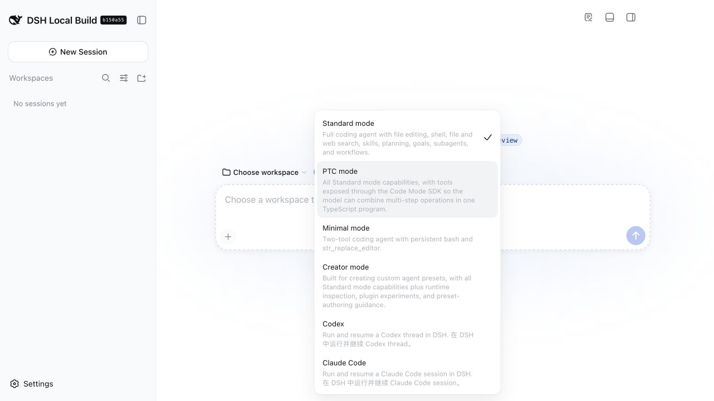

# 在 DeepSeek Harness 中使用 Codex 对话

[](https://www.npmjs.com/package/relay-dsh-plugin-codex)
[](https://github.com/yangbobo2021/relay-dsh-plugin-codex/actions/workflows/ci.yml)
[](https://www.npmjs.com/package/relay-dsh-plugin-codex)
[](https://github.com/yangbobo2021/relay-dsh-plugin-codex/stargazers)
[](LICENSE)
[](https://github.com/deepseek-ai/deepseek-harness)
[](https://www.npmjs.com/package/relay-dsh-plugin-codex/v/0.1.1-rc.3)

[English](README.md) | 中文

**npm 包名：** [`relay-dsh-plugin-codex`](https://www.npmjs.com/package/relay-dsh-plugin-codex)
· [全部 Relay DSH 插件](https://github.com/yangbobo2021/Relay/blob/codex/relay-foundation/docs/dsh-plugins.zh.md)

[](https://github.com/yangbobo2021/Relay/blob/codex/relay-foundation/docs/dsh-plugins.zh.md)

*演示来自官方 DSH 上的真实 npm 安装：Codex 与 Claude 返回真实回复，Files
预览工作区文件，Terminal 实际执行命令。[观看 H.264
MP4](https://github.com/yangbobo2021/Relay/blob/codex/relay-foundation/docs/media/dsh-plugin-suite-demo.mp4?raw=1)。*

`relay-dsh-plugin-codex` 为官方
[DeepSeek Harness](https://github.com/deepseek-ai/deepseek-harness)（DSH）Web
界面增加 **Codex 对话后端**。安装后，DSH 的新建会话模式菜单中会出现
**Codex**。每个 DSH Session 会绑定一个 Codex App Server Thread。



上图来自安装了 Codex 和 Claude 插件的官方 DSH `0.1.1-rc.2`。如果只安装
本插件，菜单中只会新增 **Codex**。

## 什么情况下需要这个插件？

以下情况适合安装：

- 希望直接在 DSH 中使用 Codex，而不必切换到单独的 Codex 界面；
- 希望保留 DSH 原生的对话历史、输入框、审批、提问和工具展示；
- 希望一个 DSH Session 在多轮对话中持续使用同一个 Codex App Server
  Thread；
- 希望在同一对话中使用 Codex 模型、reasoning effort、图片、中断以及 DSH
  插件贡献的工具。

使用 DSH 标准 Agent 不需要安装本插件。本插件也不提供 Relay Events、文件
浏览和终端面板，这些能力由其他可选插件提供。

## 基于官方 DSH 的快速安装

以下步骤已经在这些版本上实际验证：

- DeepSeek Harness `0.1.1-rc.2`，commit
  [`b150a551`](https://github.com/deepseek-ai/deepseek-harness/commit/b150a551b8d465e31e418e1b2eaf5e79bbb7d28e)
- Node.js 22.13 或更高版本
- `pnpm` 已加入 `PATH`

DSH 当前仍是开发者预览版本，可能发生不兼容修改。本仓库会跟进官方版本，
并在这里记录已经验证的版本。

### 1. 准备 Codex 认证

插件会安装一个固定版本的官方 `@openai/codex` 运行时，并以 App Server 模式
启动它。该运行时包含 macOS、Windows、Linux 的 x64 和 arm64 原生二进制，
因此 DSH 不需要从自身的 `PATH` 中寻找 `codex` 命令。

Codex 仍然需要认证。首次创建 DSH Codex 会话前，请安装或打开任一官方 Codex
客户端并完成登录。使用 CLI 时，可以通过以下命令检查共享的本地认证状态：

```bash
codex --version
codex login
```

安装及登录方式参见官方 [Codex CLI 文档](https://learn.chatgpt.com/docs/codex/cli)
和[认证文档](https://learn.chatgpt.com/docs/auth)。认证信息仍由 Codex 原有的
本地机制管理，本插件不会收集认证信息。安装本插件会提供 App Server 运行时，
但不会向系统全局安装 `codex` Shell 命令。

### 2. 选择安装来源并安装

修改 Profile 插件前，请先停止正在运行的 DSH Web，然后从以下来源中选择
一种。

#### npm 正式版

本插件发布到 npm 的正式包名是
[`relay-dsh-plugin-codex`](https://www.npmjs.com/package/relay-dsh-plugin-codex)。
使用 `@latest` 安装当前稳定版本：

```bash
npx @deepseek-ai/dsh@0.1.1-rc.2 plugin --profile web add relay-dsh-plugin-codex@latest
```

本文更新时，`latest` 指向稳定版 `0.1.0`。最新版本请以链接中的 npm 页面
为准。

#### npm 预发布版（DSH 预览阶段推荐）

使用 `@next` 安装已经通过本仓库 CI 发布流程和官方 DSH 兼容性测试的最新
候选版本。当前候选版本还内置了跨平台 App Server 运行时，因此 DSH 不依赖
系统全局的 `codex` 可执行文件：

```bash
npx @deepseek-ai/dsh@0.1.1-rc.2 plugin --profile web add relay-dsh-plugin-codex@next
```

本文更新时，`next` 指向 `0.1.1-rc.3`。

#### GitHub 开发版

如需测试尚未发布的修改，可以直接安装当前 `main` 分支：

```bash
npx @deepseek-ai/dsh@0.1.1-rc.2 plugin --profile web add github:yangbobo2021/relay-dsh-plugin-codex#main
```

`main` 会持续变化。如需可复现的 GitHub 安装，请固定 Tag 或完整 Commit
SHA。例如：

```bash
npx @deepseek-ai/dsh@0.1.1-rc.2 plugin --profile web add github:yangbobo2021/relay-dsh-plugin-codex#v0.1.1-rc.3
```

官方 DSH CLI 会在需要时初始化 `web` Profile，通过 `pnpm` 安装所选软件包，
并将插件加入 Bundle 配置。用户不需要下载 Relay 仓库。如果已经安装了持久
可用的 `dsh` 命令，可以将上述任一命令开头的
`npx @deepseek-ai/dsh@0.1.1-rc.2` 替换为 `dsh`。

### 3. 启动或重启 DSH Web

```bash
npx @deepseek-ai/dsh@0.1.1-rc.2 web
```

如果使用已经安装的命令，则执行 `dsh web`。DSH 只在启动时读取 Bundle
成员，因此安装、更新或删除插件后必须重启。

### 4. 新建 Codex 对话

1. 打开终端中显示的 DSH 地址，默认是 `http://127.0.0.1:3080`。
2. 首次启动时阅读 DSH 测试提示，然后点击 **Continue**。
3. 点击左侧栏的 **Add workspace**，选择允许 Codex 操作的项目目录。
4. 点击 **New Session**。
5. 打开当前显示为 **Standard mode** 的模式菜单，选择 **Codex**。
6. 输入消息并发送。请在发送第一条消息前选择后端；已有会话会继续使用创建
   时选择的后端。

插件不需要单独的激活命令。安装成功并重启 DSH 后，Bundle 会自动激活，
并注册由插件管理的 **Codex** 模式。

## 支持的能力

- 每个 DSH Session 持续绑定一个 Codex App Server Thread
- 模型和 reasoning effort 选择
- 在 DSH 原生对话中流式显示回答和 reasoning
- DSH 原生审批和用户提问流程
- 图片、工具活动、中断和会话延续
- 在 Codex App Server 的 `dsh` namespace 中提供通用 DSH 工具
- 安装独立 Relay 终端插件后，可选贡献终端传输 Provider

工具通过当前 Agent 的 DSH 工具运行时执行，并继续受到 DSH 权限和 Codex
审批机制约束。

## 插件边界及与 Relay 的关系

本仓库在 [Relay](https://github.com/yangbobo2021/Relay) 项目中完成设计与
兼容性验证。Relay 是面向长时间运行 Agent、外部事件投递、可复用 DSH
工作台视图和多种对话后端的开源项目。

本插件可以独立安装。运行时不依赖 Relay 应用、Relay Events 或其他 Relay
插件，也不会替换 DSH 官方布局或安装 Files、Terminal 视图。用户可以只安装
Codex；需要时，Relay 项目则可以进一步组合 Codex、Claude、事件、Wait、
Monitor 和工作台扩展。

可以访问或 Star Relay 仓库，关注这些更完整的工作：
<https://github.com/yangbobo2021/Relay>。

## 更新、检查或删除

修改 Bundle 前先停止 DSH Web，完成后重新启动。

```bash
# 检查插件为何被安装
dsh plugin --profile web why relay-dsh-plugin-codex

# 更新 npm 依赖
dsh plugin --profile web update relay-dsh-plugin-codex

# 删除插件
dsh plugin --profile web remove relay-dsh-plugin-codex
```

如果没有持久安装 `dsh` 命令，请将命令开头的 `dsh` 替换为
`npx @deepseek-ai/dsh@0.1.1-rc.2`。

## 常见问题

### 模式菜单中没有 Codex

先重启 DSH Web，再执行 `dsh plugin --profile web why
relay-dsh-plugin-codex`。如果 pnpm 找不到插件，请重新执行 npm 安装命令，
并查看最后显示的错误。

### 第一条消息提示认证失败或找不到可执行文件

请使用官方 Codex 客户端，以启动 DSH 的同一个操作系统用户执行 `codex
login`，然后重启 DSH。插件默认使用随插件安装的官方 `@openai/codex` 运行时，
不依赖 `PATH`。

如果错误提示随包运行时缺失，请更新或重新安装插件，让包管理器恢复当前平台
对应的 optional dependency。受管部署也可以明确指定其他 Codex 原生可执行文件：

```bash
# macOS 或 Linux
RELAY_CODEX_COMMAND=/absolute/path/to/codex dsh web
```

```powershell
# Windows PowerShell
$env:RELAY_CODEX_COMMAND = 'C:\absolute\path\to\codex.exe'
dsh web
```

DSH Bundle 配置项 `codexCommand` 的优先级高于 `RELAY_CODEX_COMMAND`。建议填写
原生可执行文件的绝对路径；两者都不设置时，会使用随插件发布并完成兼容性验证
的 Codex 版本。

### 输入框不可用

DSH 在开始编码对话前必须选择工作区。点击 **Add workspace**，选择一个目录，
然后返回 **New Session**。

### 安装时提示找不到 pnpm

按照 pnpm 的[官方安装说明](https://pnpm.io/installation)安装，并在同一个
终端中确认 `pnpm --version` 可以执行。

### DSH 更新后插件无法启动

DSH 仍是开发者预览版本。请在
[GitHub Issue](https://github.com/yangbobo2021/relay-dsh-plugin-codex/issues)
中附上 `dsh --version` 输出、插件源码版本和启动错误。

## 开发验证

```bash
git clone https://github.com/yangbobo2021/relay-dsh-plugin-codex.git
cd relay-dsh-plugin-codex
npm install
DSH_ROOT=/path/to/deepseek-harness npm run verify
npm pack
```

`npm run verify` 会执行类型检查、测试和生产构建。边界测试会阻止插件意外
增加对 Relay 或其他功能插件的运行时依赖。

## 反馈

请通过本仓库的
[Issue Tracker](https://github.com/yangbobo2021/relay-dsh-plugin-codex/issues)
报告错误或提出功能建议。
